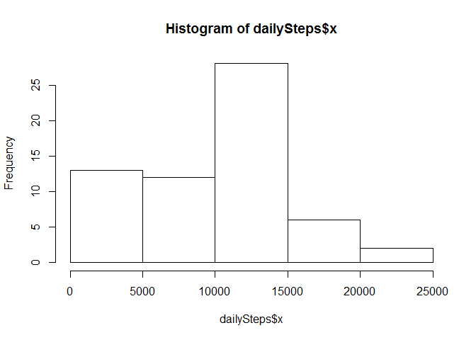
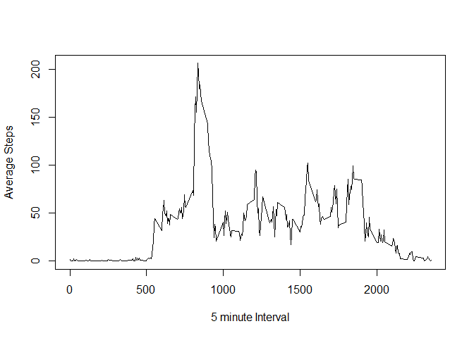
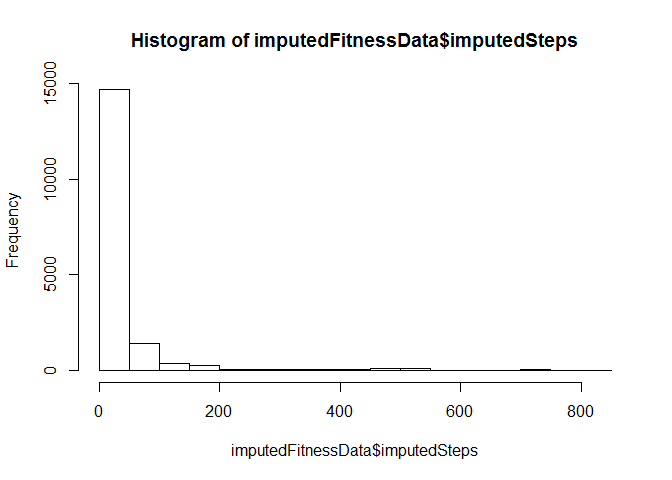
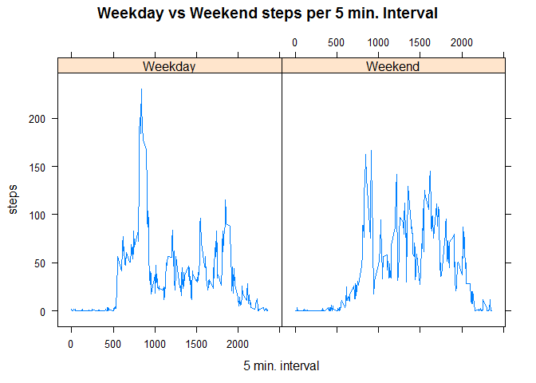

# Reproducible Research: Peer Assessment 1


## Reading The Data In
#### After downloading the file from [https://d396qusza40orc.cloudfront.net/repdata%2Fdata%2Factivity.zip"]

#### Read in the data set.

```r
fitnessData <- read.csv("~/Coursera_R/fitbit/activity.csv") 
```

## A histogram of the total number of steps taken each day.


```r
# First need to aggeragate data by day.
dailyStepsSumByDay <- aggregate(fitnessData$steps, by=list(fitnessData$date), FUN=sum,na.rm=TRUE) 
# Plot historgram of tiotla number of steps taken each day.
hist(dailySteps$x)
```

 

#### Then calculate mean by day:

```r
mean(dailySteps$x,)
```

```
## [1] 9354.23
```
#### Then calculate median by day:

```r
median(dailySteps$x,)
```

```
## [1] 10395
```

## What is the average daily activity pattern?
####Determine the daily activity pattern by aggregating by the 5 min. interval

```r
averageStepsPerInterval <-aggregate(fitnessData$steps, by=list(fitnessData$interval), FUN=mean,na.rm=TRUE) 
```
#### Plot the average number of steps taken (averaged across all days) versus the 5-minute intervals.

```r
plot(averageStepsPerInterval,type="l", xlab= "5 minute Interval", ylab= "Average Steps") 
```

 

## Report the 5-minute interval that, on average, contains the maximum number of steps.

```r
averageStepsPerInterval[which.max(averageStepsPerInterval$x),]
```

```
##     Group.1        x
## 104     835 206.1698
```


## Imputing missing values
#### Impute the missing base NA's using the Interval average.
#### Merge the intervalaverage data set and base data set

```r
mergedFitnessData <- merge(fitnessData,averageStepsPerInterval, by.x = "interval", by.y="Group.1",all.x=TRUE) 
```
#### Create a new dataset that is equal to the original dataset but with the missing data filled in.

```r
imputedFitnessData <- transform(mergedFitnessData, imputedSteps = ifelse(is.na(steps), x, steps)) 
```

## A histogram of the total number of steps taken each day after missing values were imputed.

```r
#Aggergate by day
dailyImputedStepsSumByDay <- aggregate(fitnessData$steps, by=list(imputedFitnessData$date), FUN=sum,na.rm=TRUE) 

# Plot historgram of imputed steps by day
hist(imputedFitnessData$imputedSteps)
```

 

## Are there differences in activity patterns between weekdays and weekends?  The grpahs below show greater activity across intervals on the weekends.

```r
# Determine Day of Week
imputedFitnessData$dayofweek <- weekdays(as.Date(imputedFitnessData$date))

# Determine Weekends
weekendImputedDate <- transform(imputedFitnessData, dayType = ifelse(imputedFitnessData$dayofweek=="Saturday"|imputedFitnessData$dayofweek=="Sunday","Weekend","Weekday")) 

averageImputedStepsPerInterval <-aggregate(imputedSteps ~ interval + dayType,data=weekendImputedDate,  FUN=mean) 

#plot the average number of steps taken per 5-minute interval across weekdays and weekends

library(lattice)
```

```
## Warning: package 'lattice' was built under R version 3.1.3
```

```r
head(averageImputedStepsPerInterval)
```

```
##   interval dayType imputedSteps
## 1        0 Weekday   2.25115304
## 2        5 Weekday   0.44528302
## 3       10 Weekday   0.17316562
## 4       15 Weekday   0.19790356
## 5       20 Weekday   0.09895178
## 6       25 Weekday   1.59035639
```

```r
xyplot(imputedSteps ~ interval| dayType, data=averageImputedStepsPerInterval, type="l", xlab = "5 min. interval", ylab = "steps", main = "Weekday vs Weekend steps per 5 min. Interval")
```

 


